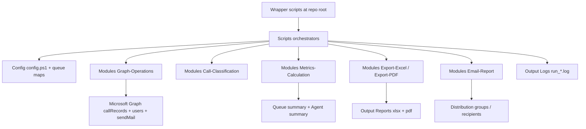

# Behr Service Center Reports

Modular PowerShell reporting pipeline for Microsoft Teams Call Queue analytics, with production-safe deployment and rollback scripts.

## 1. Purpose

This project generates and distributes Service Center reports by:

- Pulling call records from Microsoft Graph.
- Classifying queue traffic into offered, answered, voicemail, abandoned, and SLA attainment.
- Producing Excel and PDF artifacts.
- Sending report attachments through Graph Mail.
- Supporting both normal multi-queue reporting and a dedicated Solutions Center stream.

## 2. How This Was Built

This solution was intentionally split into layers so changes can be made with low risk:

- Thin entrypoint wrappers at repo root preserve existing scheduled-task compatibility.
- Orchestrator scripts in Scripts/ own runtime flow (date window, module loading, logging, IO, email).
- Shared business and platform logic lives in Modules/ (Graph access, classification, aggregation, export, mail).
- Runtime settings and queue mappings live in Config/.
- Output and logs are written to Output/ with per-run IDs for traceability.
- Production operations use Git-based scripts (deploy, rollback, finalize) so releases are auditable and reversible.

### Architecture at a Glance



## 3. Repository Layout

- Config/
   - config.ps1: central runtime configuration.
   - queues.json: standard multi-queue map.
   - queues-solutions-center.json: Solutions Center map.
- Modules/
   - Graph-Operations.ps1: auth, retries, paging, queue call retrieval, user-name resolution.
   - Call-Classification.ps1: call segment parsing and answered/voicemail/abandoned determination.
   - Metrics-Calculation.ps1: queue and agent rollups.
   - Export-Excel.ps1: workbook + chart generation (ImportExcel).
   - Export-PDF.ps1: HTML-to-PDF rendering (wkhtmltopdf).
   - Email-Report.ps1: recipient expansion and Graph sendMail delivery.
   - Logging.ps1: run IDs and structured logs.
- Scripts/
   - On-Demand-Report.ps1: main ad-hoc standard report pipeline.
   - Last-7Days-Report.ps1: standard weekly wrapper (calls on-demand script).
   - Monthly-Report.ps1: standard last-28-days wrapper.
   - On-Demand-Report-SolutionsCenter.ps1: ad-hoc Solutions Center pipeline.
   - Last-7Days-Report-SolutionsCenter.ps1: Solutions Center weekly wrapper.
   - Monthly-Report-SolutionsCenter.ps1: Solutions Center last-28-days wrapper.
- Output/
   - Reports/: generated xlsx/pdf files.
   - Logs/: runtime logs.
   - Archive/: optional archive target.
- Scheduled-Tasks/
   - Install-AzureAutomationSchedule.ps1: prints Az.Automation commands for schedule setup.
- Tests/
   - Test-Classification.ps1 and Test-Metrics.ps1: logic sanity checks.
- Deploy-Prod.ps1, Rollback-Prod.ps1, Finalize-Prod-Update.ps1
   - controlled production lifecycle scripts.

## 4. Runtime Flow

Each orchestrator script follows the same high-level sequence:

1. Load config and module files.
2. Create run context and log file.
3. Build effective date window and normalize to Graph-safe boundaries.
4. Connect to Microsoft Graph using app + certificate authentication.
5. Pull call records by queue with paging and retries.
6. Convert calls into metric rows and classify outcomes.
7. Resolve missing answering-agent names by querying Graph users.
8. Build queue summary and agent summary.
9. Export Excel and PDF outputs.
10. Send email with attachments unless SkipEmail is set.
11. Disconnect Graph and finalize logs.

## 5. Prerequisites

### Runtime

- PowerShell 7+
- Git (for deployment/rollback scripts)
- wkhtmltopdf installed and available in PATH or default install location

### PowerShell modules

```powershell
Install-Module Microsoft.Graph.Authentication -Scope CurrentUser -Force
Install-Module ImportExcel -Scope CurrentUser -Force
```

### Graph app permissions

Application permissions with admin consent:

- CallRecords.Read.All
- Mail.Send

Certificate-based authentication is required for non-interactive execution.

## 6. Configuration

Update Config/config.ps1 for your environment.

### Graph block

- TenantId: Entra tenant.
- ClientId: app registration client ID.
- CertificateThumbprint: local cert thumbprint used by Connect-MgGraph.
- Scope: normally https://graph.microsoft.com/.default.
- MaxRetryCount / InitialRetryDelaySeconds: retry behavior for Graph calls.

### Reporting block

- DaysDelayForDataFinalization: reserved for delayed data strategy.
- SLASeconds: wait-time threshold for AnsweredUnderSLA.
- OutputRoot, ReportsPath, LogsPath, ArchivePath: output locations.
- PdfGenerator: command name/path, default wkhtmltopdf.

### Email block

- SenderMailbox: mailbox used with users/{sender}/sendMail.
- ToRecipients: default recipient list for standard reports.
- SubjectPrefix: email subject prefix.

### EmailGroups block

- StandardReports and SolutionsCenter recipient groups.
- Solutions Center scripts override recipients with EmailGroups.SolutionsCenter when available.

### Files block

- QueueMapFile: default standard queue map path.

### Queue maps

- Config/queues.json: standard report queues.
- Config/queues-solutions-center.json: dedicated Solutions Center queue(s).

## 7. How To Run

Run from repo root with PowerShell 7.

### Standard report stream

Monthly (last 28 days):

```powershell
pwsh ./Monthly-Report.ps1
```

Weekly (last 7 days):

```powershell
pwsh ./Last-7Days-Report.ps1
```

On-demand date range:

```powershell
pwsh ./On-Demand-Report.ps1 -StartDate "2026-07-01" -EndDate "2026-07-08"
```

On-demand with custom output base name:

```powershell
pwsh ./Scripts/On-Demand-Report.ps1 -StartDate "2026-07-01" -EndDate "2026-07-08" -OutputName "My-Custom-Report"
```

Dry run without email:

```powershell
pwsh ./On-Demand-Report.ps1 -StartDate "2026-07-01" -EndDate "2026-07-08" -SkipEmail
```

### Solutions Center stream

Weekly:

```powershell
pwsh ./SolutionsCenter-Last-7Days-Report.ps1
```

Monthly (last 28 days):

```powershell
pwsh ./SolutionsCenter-Monthly-Report.ps1
```

On-demand date range:

```powershell
pwsh ./Scripts/On-Demand-Report-SolutionsCenter.ps1 -StartDate "2026-07-01" -EndDate "2026-07-08"
```

Override queue map path if needed:

```powershell
pwsh ./Scripts/On-Demand-Report-SolutionsCenter.ps1 -StartDate "2026-07-01" -EndDate "2026-07-08" -QueueMapPath "C:\Temp\queues-solutions-center.json"
```

## 8. Outputs and Logs

- Reports are written to Output/Reports.
- Logs are written to Output/Logs.
- Each run receives a unique run ID used in log names and some fallback output filenames.
- If an output file is locked, scripts retry with a RunId suffix to avoid collisions.

Default naming examples:

- Behr-ServiceCenter-Monthly_YYYYMMDD_to_YYYYMMDD.xlsx
- Behr-ServiceCenter-Weekly_YYYYMMDD_to_YYYYMMDD.pdf
- Behr-SolutionsCenterWeekly_YYYYMMDD_to_YYYYMMDD.xlsx
- Behr-SolutionsCenterMonthly_YYYYMMDD_to_YYYYMMDD.pdf

## 9. Testing and Validation

Run logic checks before merging or deploying:

```powershell
pwsh ./Tests/Test-Classification.ps1
pwsh ./Tests/Test-Metrics.ps1
```

Recommended dry-run validation:

```powershell
pwsh ./Scripts/On-Demand-Report.ps1 -StartDate "2026-07-01" -EndDate "2026-07-08" -SkipEmail
pwsh ./Scripts/On-Demand-Report-SolutionsCenter.ps1 -StartDate "2026-07-01" -EndDate "2026-07-08" -SkipEmail
```

## 10. How To Update The Project

Primary references:

- PROD-Update-Workflow.md
- QUICK-UPDATE-CHECKLIST.md

Recommended daily update flow:

1. Make and test changes locally from dev branch.
2. Push feature branch and merge into dev.
3. Validate dev behavior.
4. Promote dev to main by PR.
5. Tag release in main.
6. Pull/deploy on production VM with Deploy-Prod.ps1.
7. Roll back quickly with Rollback-Prod.ps1 if needed.
8. Use Finalize-Prod-Update.ps1 to return VM to tracked branch and append deployment history.

### Local test cycle example

```powershell
git checkout dev
git pull origin dev
pwsh ./Tests/Test-Classification.ps1
pwsh ./Tests/Test-Metrics.ps1
pwsh ./Scripts/On-Demand-Report.ps1 -StartDate "2026-07-01" -EndDate "2026-07-08" -SkipEmail
```

### Deploy to production VM

```powershell
pwsh ./Deploy-Prod.ps1 -RepoPath . -Branch main -RunValidation
```

### Deploy a specific tag

```powershell
pwsh ./Deploy-Prod.ps1 -RepoPath . -Tag v2026.07.20.1 -RunValidation
```

### Roll back to known good tag

```powershell
pwsh ./Rollback-Prod.ps1 -RepoPath . -Tag v2026.07.10.1 -RunValidation
```

### Finalize after rollback testing

```powershell
pwsh ./Finalize-Prod-Update.ps1 -RepoPath . -SwitchToMain -Branch main -RunValidation -Note "Rollback test complete"
```

## 11. Scheduling

Use Scheduled-Tasks/Install-AzureAutomationSchedule.ps1 to print Az.Automation commands for a monthly day-1 06:00 schedule.

Example:

```powershell
pwsh ./Scheduled-Tasks/Install-AzureAutomationSchedule.ps1 -ResourceGroupName "<rg>" -AutomationAccountName "<account>"
```

## 12. Troubleshooting

### No data returned

- Confirm queue IDs are correct in the relevant queue map.
- Check date range is inside Graph callRecords retention (safe window enforces about 30 days).
- Review Output/Logs/run_*.log for normalized window warnings.

### Script says output file is in use

- Close the target xlsx/pdf if open.
- Script will auto-retry using a RunId suffix.

### PDF generation fails

- Confirm wkhtmltopdf is installed.
- Ensure Reporting.PdfGenerator points to a valid command/path.

### Missing agent names

- Scripts attempt resolution from Graph users endpoint.
- Some identities may remain unresolved if not user-backed or inaccessible.

### Email delivery issues

- Verify Mail.Send application permission and admin consent.
- Confirm SenderMailbox exists and app is authorized.
- Confirm recipient groups resolve and contain mail-enabled members.

## 13. Operational Notes

- Root wrapper scripts call Scripts/ orchestrators and are useful for scheduled task stability.
- AAGraphreport.ps1 is retained as legacy reference and is not part of the modular pipeline flow.
- Monthly scripts currently use a rolling 28-day window, not a strict calendar month.
- Standard production branch in scripts is main (some older checklist text may still say master).

## 14. Suggested Change Policy

When changing logic, keep updates isolated by module:

- Classification behavior: Modules/Call-Classification.ps1
- Rollup math: Modules/Metrics-Calculation.ps1
- Export format/layout: Modules/Export-Excel.ps1 and Modules/Export-PDF.ps1
- Graph/transport behavior: Modules/Graph-Operations.ps1 and Modules/Email-Report.ps1

Then run tests plus one dry run before merge/deploy.
